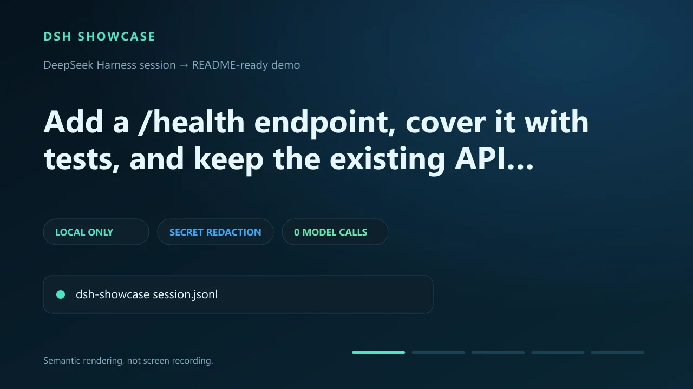

# dsh-session-showcase

[English](#english) | [简体中文](#简体中文)

[](https://github.com/STFQ/dsh-showcase/actions/workflows/ci.yml)
[](https://nodejs.org/)
[](LICENSE)



## English

**GitHub-ready demos from DeepSeek Harness sessions.** `dsh-session-showcase` turns an official DeepSeek Harness (DSH) session export, raw JSONL log, or Zstandard session log into a polished animated WebP/GIF, poster, social preview, README snippet, and machine-readable manifest. It can run as a standalone CLI or as a native DSH tool plugin.

It runs locally, executes no session tools, uploads nothing, and makes **zero AI/model calls**.

For DSH, install the GitHub package into the profile you use:

```bash
dsh plugin --profile <profile> add github:STFQ/dsh-showcase
```

The plugin registers `dsh_showcase`. It reads a local session export through DSH's filesystem provider, writes to the local workspace, and never uploads the session or calls a model.

### Why this exists

DSH records semantic events—prompts, tool calls, diffs, results, and final answers. A screen recorder sees pixels; `dsh-session-showcase` sees those events and turns the useful moments into a short, repeatable story for a GitHub README, plugin launch, issue, or release.

|                 | Screen recorder | Replay viewer        | dsh-session-showcase         |
| --------------- | --------------- | -------------------- | ---------------------------- |
| Input           | Pixels          | Full transcript      | Semantic DSH events          |
| Output          | Long video      | Interactive debugger | Short README-ready animation |
| Secret handling | Manual          | Varies               | Redaction on by default      |
| Model/API usage | None            | Varies               | None                         |

### Quick start

Requirements: Node.js **22.19 or newer**. No FFmpeg and no API key are required.

#### Try it immediately (no DSH account or API key)

Render the included safe fixture first. This proves the complete output path in about 10 seconds:

```bash
git clone https://github.com/STFQ/dsh-showcase.git
cd dsh-showcase
npm install
npm run build
node dist/cli.js examples/session.jsonl --output ./showcase --format both
```

#### Render a real DSH session

1. In the DSH Web UI, run `/export` in the session you want to share. DSH downloads an official session ZIP.
2. Install the plugin into the profile you use:

```bash
dsh plugin --profile <profile> add github:STFQ/dsh-showcase
```

The plugin registers the `dsh_showcase` tool. Ask DSH to render the exported ZIP, for example:

```text
Use dsh_showcase on dsh-session-<id>.zip. Write both WebP and GIF to ./.dsh/showcase,
use the default automatic redaction, and return the generated artifact paths.
```

3. If you only need the standalone CLI, install the package after the next npm release:

```bash
npm install --global dsh-session-showcase
```

4. Render it locally:

```bash
dsh-showcase dsh-session-<id>.zip --output ./showcase
```

4. Copy the generated snippet into your README:

```text
showcase/
├── hero.webp
├── poster.png
├── social-preview.png
├── README-snippet.md
└── showcase.manifest.json
```

Generate both animated WebP and GIF:

```bash
dsh-showcase session.jsonl --format both --theme midnight
```

Preview scene selection and redaction without writing files:

```bash
dsh-showcase session.jsonl --dry-run --json
```

### What it reads

- Official DSH session export ZIP (`session.jsonl` at the archive root)
- Raw DSH `session.jsonl`
- Default concatenated-frame `session.jsonl.zstd`
- Packed `text-chunks`, `reasoning-chunks`, and `tool-call-chunks` storage rows
- Standard input with `-`

Version 0.2 adds the DSH plugin entry point while keeping the standalone CLI. It renders the root session and reports included subagent logs without rendering them. See the [verified compatibility contract](docs/session-format.md).

### Privacy and redaction

Redaction is enabled by default and covers common API keys, GitHub tokens, JWTs, bearer tokens, secret assignments, email addresses, credentialed URLs, and home-directory paths.

```bash
# Redact and continue (default)
dsh-showcase session.jsonl --redact auto

# Fail before writing when anything sensitive is detected
dsh-showcase session.jsonl --redact strict

# Disable only after reviewing the source
dsh-showcase session.jsonl --redact off
```

Reasoning blocks and request headers are never selected as showcase scenes. Redaction is defense in depth, not a guarantee; review generated artifacts before publishing. Read the [security and privacy model](docs/security.md).

### Automation and agents

`--json` keeps stdout machine-only; warnings and errors go to stderr. The versioned result is described by [`schemas/result.schema.json`](schemas/result.schema.json).

```bash
dsh-showcase session.jsonl --dry-run --json > plan.json
```

Agent entry points:

- [`llms.txt`](llms.txt): compact product and documentation map
- [`docs/cli.md`](docs/cli.md): complete CLI and exit-code contract
- [`docs/plugin.md`](docs/plugin.md): DSH plugin installation and tool contract
- [`docs/session-format.md`](docs/session-format.md): verified DSH adapter contract
- [`schemas/manifest.schema.json`](schemas/manifest.schema.json): generated manifest contract
- [`AGENTS.md`](AGENTS.md): contributor-agent instructions

### Common options

| Option                             | Meaning                           |
| ---------------------------------- | --------------------------------- |
| `-o, --output <dir>`               | Output directory                  |
| `--format webp\|gif\|both`         | Animated output format            |
| `--theme deepsea\|midnight\|paper` | Visual theme                      |
| `--redact auto\|strict\|off`       | Secret handling policy            |
| `--title <text>`                   | Cover-title override              |
| `--max-scenes <2-8>`               | Scene count including the cover   |
| `--dry-run`                        | Parse and inspect without writing |
| `--overwrite`                      | Replace known generated files     |
| `--json`                           | Versioned machine-readable stdout |

Run `dsh-showcase --help` or read the [complete CLI reference](docs/cli.md).

### Design references

This project follows the DSH session/export contract pinned to the verified rc.8 revision and established CLI conventions rather than inventing an incompatible transcript format. The exact upstream sources and mature projects reviewed are recorded in [docs/design.md](docs/design.md). Code adapted from DeepSeek Harness retains its MIT notice in [THIRD_PARTY_NOTICES.md](THIRD_PARTY_NOTICES.md).

### Contributing and security

See [CONTRIBUTING.md](CONTRIBUTING.md). Please use GitHub private vulnerability reporting as described in [SECURITY.md](SECURITY.md); if it is unavailable, open an issue without exploit details or private data to request a private channel.

`dsh-session-showcase` is an independent community project and is not affiliated with or endorsed by DeepSeek. DeepSeek and DeepSeek Harness are referenced only to describe compatibility.

---

## 简体中文

**把 DeepSeek Harness 会话变成可直接放进 GitHub README 的演示素材。** `dsh-session-showcase` 可以读取 DeepSeek Harness（DSH）官方导出的会话 ZIP、原始 JSONL 或 Zstandard 会话日志，生成精致的 WebP/GIF 动图、封面、社交预览图、README 片段和机器可读清单；它既可以作为独立 CLI，也可以作为 DSH 原生工具插件运行。

它完全在本地运行，不执行会话中的工具、不上传数据，且 **不会调用任何 AI 模型，不消耗 Token**。

在 DSH 中，请把 GitHub 包安装到你使用的 profile：

```bash
dsh plugin --profile <profile> add github:STFQ/dsh-showcase
```

插件会注册 `dsh_showcase` 工具，通过 DSH 文件系统读取本地会话并写入本地工作区，不上传会话，也不调用模型。

### 为什么做这个项目

DSH 会记录提示词、工具调用、代码差异、执行结果和最终回答等语义事件。录屏工具看到的是像素，而 `dsh-session-showcase` 能理解这些事件，并把真正有价值的节点整理成一段简短、可重复生成的故事，适合放在 GitHub README、插件发布帖、Issue 或 Release 中。

|               | 录屏工具 | 会话回放器     | dsh-session-showcase |
| ------------- | -------- | -------------- | -------------------- |
| 输入          | 屏幕像素 | 完整会话       | DSH 语义事件         |
| 输出          | 较长视频 | 交互式调试页面 | README 可用的短动图  |
| 敏感信息处理  | 手动     | 各不相同       | 默认自动脱敏         |
| 模型/API 消耗 | 无       | 各不相同       | 无                   |

### 快速开始

需要 Node.js **22.19 或更高版本**，不需要 FFmpeg，也不需要 API Key。

#### 立即试用（无需 DSH 账号或 API Key）

先用仓库内置的安全示例生成完整产物，约 10 秒即可确认流程：

```bash
git clone https://github.com/STFQ/dsh-showcase.git
cd dsh-showcase
npm install
npm run build
node dist/cli.js examples/session.jsonl --output ./showcase --format both
```

#### 生成真实 DSH 会话演示

1. 在 DSH Web 界面的目标会话中运行 `/export`，下载官方会话 ZIP。
2. 把插件安装到你使用的 profile：

```bash
dsh plugin --profile <profile> add github:STFQ/dsh-showcase
```

插件会注册 `dsh_showcase` 工具。可以这样请求 DSH 生成演示：

```text
使用 dsh_showcase 处理 dsh-session-<id>.zip，把 WebP 和 GIF 都写入 ./.dsh/showcase，
使用默认的自动脱敏，并返回生成文件的路径。
```

3. 如果只需要独立 CLI，等待下一版 npm 包发布后安装：

```bash
npm install --global dsh-session-showcase
```

4. 在本地生成演示：

```bash
dsh-showcase dsh-session-<id>.zip --output ./showcase
```

4. 把生成的 README 片段复制到你的项目：

```text
showcase/
├── hero.webp
├── poster.png
├── social-preview.png
├── README-snippet.md
└── showcase.manifest.json
```

同时生成 WebP 和 GIF：

```bash
dsh-showcase session.jsonl --format both --theme midnight
```

只检查场景选择和脱敏结果，不写文件：

```bash
dsh-showcase session.jsonl --dry-run --json
```

### 支持的输入

- DSH 官方会话导出 ZIP（根目录包含 `session.jsonl`）
- 原始 DSH `session.jsonl`
- 默认的多帧 `session.jsonl.zstd`
- `text-chunks`、`reasoning-chunks`、`tool-call-chunks` 压缩存储行
- 使用 `-` 从标准输入读取

0.2 版本新增 DSH 插件入口，同时保留独立 CLI；它会渲染根会话，并报告 ZIP 中的子 Agent 日志数量，但暂不渲染子 Agent。具体范围见[已验证的兼容性契约](docs/session-format.md)。

### 隐私与脱敏

脱敏默认开启，覆盖常见 API Key、GitHub Token、JWT、Bearer Token、密钥赋值、邮箱、带凭据 URL，以及用户主目录路径。

```bash
# 自动脱敏并继续（默认）
dsh-showcase session.jsonl --redact auto

# 一旦检测到敏感值，在写文件前停止
dsh-showcase session.jsonl --redact strict

# 仅在你已检查源文件时关闭
dsh-showcase session.jsonl --redact off
```

推理内容和请求头不会被选为演示场景。脱敏只是纵深防御，并非绝对保证；公开前仍应检查生成物。详见[安全与隐私模型](docs/security.md)。

### 自动化与 Agent

使用 `--json` 时，stdout 只输出机器可读 JSON，警告和错误进入 stderr。稳定结果结构见 [`schemas/result.schema.json`](schemas/result.schema.json)。

```bash
dsh-showcase session.jsonl --dry-run --json > plan.json
```

面向 Agent 的入口：

- [`llms.txt`](llms.txt)：精简的产品与文档导航
- [`docs/cli.md`](docs/cli.md)：完整 CLI 与退出码契约
- [`docs/plugin.md`](docs/plugin.md)：DSH 插件安装方式与工具契约
- [`docs/session-format.md`](docs/session-format.md)：已核验的 DSH 格式适配说明
- [`schemas/manifest.schema.json`](schemas/manifest.schema.json)：生成清单的数据契约
- [`AGENTS.md`](AGENTS.md)：贡献代码时的 Agent 指令

### 常用参数

| 参数                               | 含义                       |
| ---------------------------------- | -------------------------- |
| `-o, --output <目录>`              | 输出目录                   |
| `--format webp\|gif\|both`         | 动图格式                   |
| `--theme deepsea\|midnight\|paper` | 视觉主题                   |
| `--redact auto\|strict\|off`       | 敏感信息处理策略           |
| `--title <文本>`                   | 自定义封面标题             |
| `--max-scenes <2-8>`               | 包含封面在内的场景数       |
| `--dry-run`                        | 只解析检查，不写文件       |
| `--overwrite`                      | 覆盖已知的生成文件         |
| `--json`                           | 输出带版本号的机器可读结果 |

运行 `dsh-showcase --help`，或阅读[完整命令行文档](docs/cli.md)。

### 设计参考

本项目遵循已固定到 rc.8 并完成核验的 DSH 会话与导出契约，同时参考成熟 CLI 规范，没有另造不兼容的会话格式。核验过的上游来源和参考项目记录在 [docs/design.md](docs/design.md)。从 DeepSeek Harness 适配的代码在 [THIRD_PARTY_NOTICES.md](THIRD_PARTY_NOTICES.md) 中保留了 MIT 声明。

### 贡献与安全

贡献方式见 [CONTRIBUTING.md](CONTRIBUTING.md)。安全问题请优先按 [SECURITY.md](SECURITY.md) 使用 GitHub 私密漏洞报告；如果该入口不可用，只能创建不含漏洞细节或隐私数据的 Issue，以便索取私下联系渠道。

`dsh-session-showcase` 是独立社区项目，与 DeepSeek 无隶属或官方背书关系；文中使用 DeepSeek 和 DeepSeek Harness 名称仅用于说明兼容性。

## License

[MIT](LICENSE)
